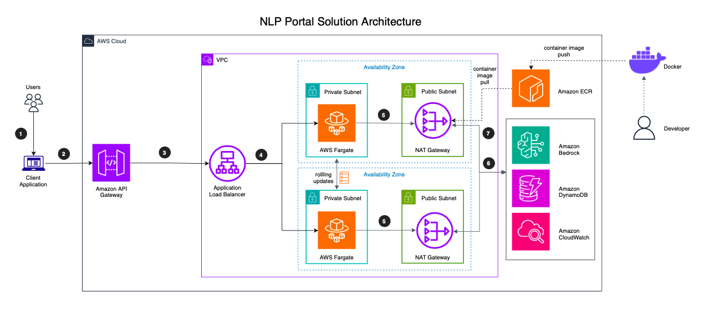
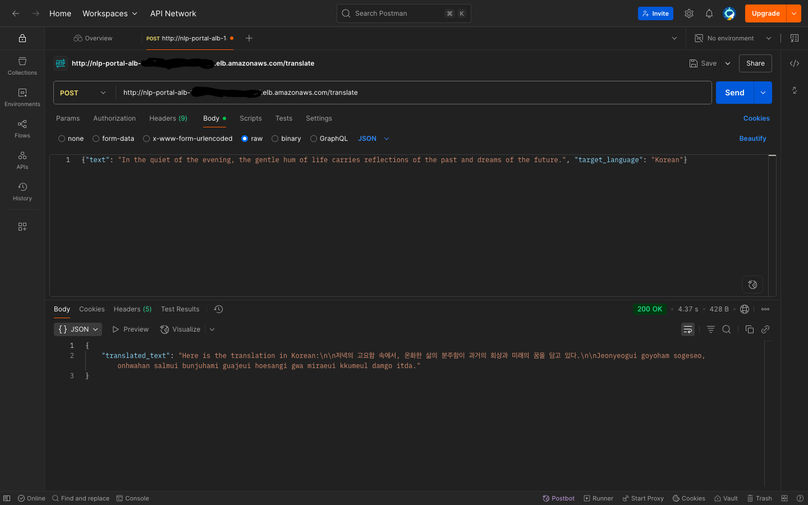
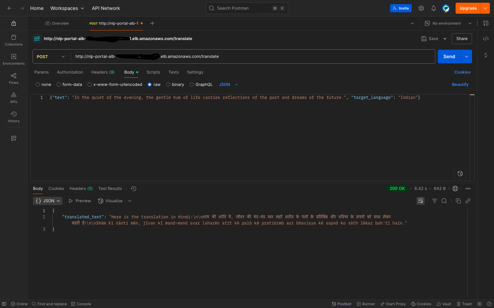
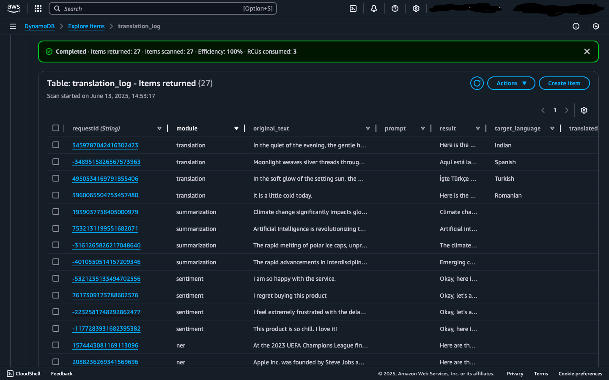
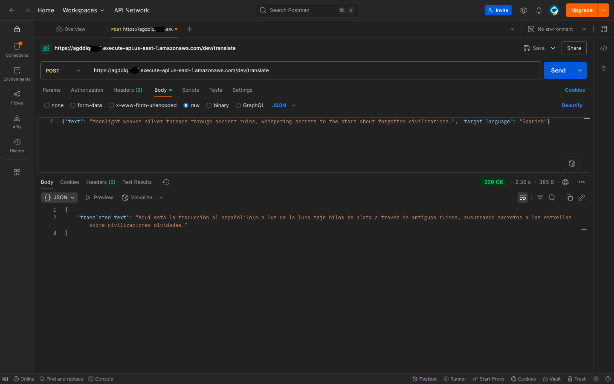

# Natural Language Processing (NLP) Portal

## Description

NLP Portal is a cloud-native Generative Artificial Intelligence (AI) Natural Language (NLP) solution built entirely on Amazon Web Services (AWS)!
In today's data-rich world, the ability to understand and process language at scale is a true game-changer.

This solution is designed as a central platform to transform unstructured text — from customer support tickets, product reviews, articles,
document repositories, and various other sources — into actionable intelligence, operational improvement, and revenue boost.


## Problem Statement

Inefficiencies hampering an organization's global operations related to processing high volumes of text data, including:

- High Customer Support Costs: Significant overhead dedicated to handling multilingual support tickets and routing basic, repetitive questions to human agents.
- Delayed Market Insights: Inability to rapidly analyze thousands of global product reviews and social media comments, leading to slow response to market trends and product quality issues.

## Business Benefits & Value Proposition

- Operational Efficiency & Cost Reduction:
    - Automation of translation of support tickets, reducing reliance on specialized services.
    - Deflection of a significant portion of common support queries through an AI-powered Q&A module.
    - Drastic reduction of hours required for manual and partially automated market research and review analysis.

- Enhanced Customer Experience (CX):
    - Provision of instant, 24/7 support in the customer's native language.
    - Self-service through an intelligent Q&A chatbot, improving customer satisfaction.

- Data-Driven Decision Making:
    - Transformation of qualitative feedback from reviews into quantitative, actionable insights for product development and marketing teams.
    - Identification of emerging product issues or popular features in near real-time.
    - Collection of data for future retraining and expansion of downstream intelligence operations.

- Scalable & Future-Proof Platform:
    - The containerized, serverless architecture ensures we only pay for what we use and can handle any future traffic load.
    - The modular design allows for the easy addition of new NLP capabilities in the future with minimal rework.

## Service Offerings

The platform provides a suite of modular, API-driven services, namely:

- Text-to-text language translation
- Sentiment analysis
- Chat
- Named entity recognition
- Text summarization

## Workflow:

A user calls any of the endpoint routes with relevant payload from a client over the internet.
The payload is received and sent to the appropriate API endpoint route, processed, saved in the db,
and the resulting response returned to the client.

The solution is designed and built according to the following principles:

- Managed services
- Elasticity of demand (auto-scaling)
- Least privilege principle (role/privilege/permission)
- Containerization (to ensure portability, consistency, and modularity)

Architecturally, the goal was a resilient, scalable, and secure solution with the following layers:

- Compute: A containerized Python app on #AWSFargate for serverless, elastic scaling.
- AI Engine: Powered by #AmazonBedrock, providing access to state-of-the-art foundation models.
- API Layer: Secured and managed by #APIGateway, with traffic distributed by an Application Load Balancer.
- High Availability: Deployed across multiple Availability Zones with a locked-down VPC.

Tech/Infrastructure Stack

- Python
- Docker
- AWS Fargate
- Amazon Bedrock
- Amazon DynamoDB
- Amazon CloudWatch
- Application Load Balancer (ALB)
- Amazon Elastic Container Registry (ECR)
- AWS Identity and Access Management (IAM)
- Network Address Translation (NAT) Gateway
- Amazon Application Programming Interface (API) Gateway

## Solution Architecture



## Solution Architecture Stage Analysis

Here is the step-by-step flow with the corresponding action:

1. From: Users -> To: Client application

- Description: User logs into a client application.

2. From: Users -> To: Amazon API Gateway

- Description: A client application sends a secure request over the internet to the API Gateway's public endpoint.

3. From: Amazon API Gateway -> To: ALB

Description: After authenticating the request and checking it against any rules,
the API Gateway forwards the request to the ALB.

3. From: Application Load Balancer -> To: AWS Fargate

- Description: The ALB, acting as a traffic controller, selects a healthy, available Fargate task and routes the request to it for processing.

5. From: AWS Fargate -> To: NAT Gateway

- Description: The Python application inside the container makes a specific, permissioned call using the AWS SDK to send the prompt to Amazon Bedrock via the NAT Gateway and get the AI-generated response.

6. From: NAT Gateway -> To: Amazon Bedrock

- Description: The NAT Gateway forwards the call to Amazon Bedrock

- From: AWS Fargate -> To: Amazon DynamoDB

- Description: The application makes another SDK call to write the results of the transaction (e.g., the original text, the translated text, timestamp) into the DynamoDB table for logging and persistence.

- From: AWS Fargate -> To: Amazon CloudWatch

- Description: Throughout its execution, the application continuously sends logs (e.g., "Translation successful for request ID 123") and performance metrics (e.g., CPU usage) to CloudWatch for monitoring and debugging.

7. From: Amazon ECR -> To: User

- Description: Response is sent back to the client aplpication.

Dotted lines:
 - From: Developer -> To: Docker (container image push to Docker repo)
 - From: Docker -> To: Amazon ECR (container image push from Docker repo to Amazon ECR repo)
 - From: Amazon ECR -> To: AWS Fargate (container image pull by Fargate from Amazon ECR)

## Detailed Solution Architecture Justification

This architecture is designed as a cloud-native, serverless, and container-based system to provide a scalable and maintainable platform for Generative AI NLP modules.

### API Management & Security

AWS Service: Amazon API Gateway
- Role in Architecture: Serves as the single, secure entry point ("front door") for all incoming client requests from the internet. It validates, authenticates, and routes requests to the appropriate backend service.
- Justification & Principle Alignment:
    - Managed Service: API Gateway is a fully managed service. This eliminates the need to provision, patch, and manage server fleets for handling API traffic, request routing, and security, directly reducing operational overhead.
    - Elasticity of Demand: It automatically scales to handle virtually any volume of incoming API calls, from one to hundreds of thousands per second. You do not need to pre-provision capacity; it scales with your usage.
    - Least Privilege Principle: It acts as the first layer of defense. By configuring authorization methods (like API Keys or IAM authorization), you ensure that only authenticated and authorized clients can access the backend, enforcing a key aspect of security at the edge.

 ### Traffic Distribution

AWS Service: Application Load Balancer (ALB)
- Role in Architecture: It receives traffic from the API Gateway and intelligently distributes it across the multiple running instances of your application container.
- Justification & Principle Alignment:
    - Managed Service: The ALB is a managed load balancer. AWS handles its maintenance, availability, and scaling.
    - Elasticity of Demand: This is the core component enabling compute elasticity. As your Fargate service scales out by adding more containers, the ALB automatically registers these new targets and begins routing traffic to them. When Fargate scales in, the ALB removes the terminated targets. This seamless integration is crucial for auto-scaling.

### Core Application Compute
AWS Services: AWS Fargate on Amazon ECS and Amazon Elastic Container Registry (ECR)
- Role in Architecture:
    - ECR: Stores your packaged application as a Docker container image.
    - Fargate: A serverless compute engine that runs your container image without requiring you to manage the underlying servers. This is where your Python application code (containing the five NLP modules) executes.
- Justification & Principle Alignment:
    - Containerization: This combination directly fulfills this core principle. You build your application into a standardized Docker container, ensuring the environment is consistent and portable from a developer's laptop to production. ECR provides a secure, private registry for these container images.
    - Managed Service: Fargate is a "serverless containers" solution. AWS is responsible for provisioning, patching, and managing the underlying EC2 instances, allowing you to focus only on your application code and container configuration.
    - Elasticity of Demand: Fargate can be configured to automatically scale the number of running containers based on real-time metrics like CPU utilization or the number of incoming requests. This ensures you have just the right amount of compute power to meet demand without over-provisioning or experiencing performance degradation.
    - Modularity: The container-based approach allows you to package all five NLP functions into one modular, deployable unit, or split them into separate microservices later if needed.

### AI & NLP Processing
AWS Service: Amazon Bedrock
- Role in Architecture: The AI "brain" of your solution. It provides simple API access to a variety of powerful foundation models to perform the actual NLP tasks (translation, summarization, etc.).
- Justification & Principle Alignment:
- Managed Service: Bedrock is the quintessential managed AI service. It entirely abstracts away the immense complexity of hosting, scaling, and maintaining large language models. This dramatically accelerates development and reduces long-term operational costs.

### Data Persistence & Observability
AWS Services: Amazon DynamoDB and Amazon CloudWatch
- Role in Architecture:
    - DynamoDB: A NoSQL database used to log each transaction (e.g., storing the request, the response, and a timestamp).
	- CloudWatch: Collects logs, metrics, and traces from all parts of the application for monitoring, debugging, and observability.

- Justification & Principle Alignment:
    - Managed Service: Both DynamoDB and CloudWatch are fully managed, serverless services. You do not manage database servers or logging infrastructure.
    - Elasticity of Demand: DynamoDB scales its read/write throughput seamlessly as your request volume grows. CloudWatch scales to ingest and process vast amounts of log and metric data without any manual intervention. They perfectly match the elastic nature of the compute layer.

### Overarching Principle: Security & Identity
AWS Service: AWS Identity and Access Management (IAM)
- Role in Architecture: IAM is not a single stage but a foundational service that underpins the entire architecture's security. It provides the roles and permissions that allow services to communicate with each other.
- Justification & Principle Alignment:
    - Least Privilege Principle: IAM is the primary tool for enforcing this principle. The Fargate task is assigned an IAM Execution Role with a very specific, granular policy. This policy grants it only the permissions it absolutely needs to function:
        - bedrock:InvokeModel to talk to Bedrock.
        - dynamodb:PutItem to write to a specific DynamoDB table.
        - logs:CreateLogStream and logs:PutLogEvents to send logs to CloudWatch.
    - The role has no permission to access any other AWS service (like S3) or any other DynamoDB table, strictly limiting its access and minimizing the potential impact of any compromise.


## Deployment Steps

**THINGS TO NOTE**:
    - **SOME OF THESE STEPS DIFFER IN ORDER, ARRANGEMENT, OR PRECEDENCE ON THE CURRENT AWS WEB INTERFACE**
    - **REPLACE VARIABLES ENCLOSED IN '<>' WITH THE ACTUAL VALUE**

### Phase 1: Prerequisites & Local Setup

This phase ensures your local machine is ready for development and deployment.

Goal: Install necessary tools, configure AWS access, and prepare your development environment.

Instructions:

- Install the AWS CLI: Follow the official AWS guide to install the AWS Command Line Interface for your operating system (macOS, Windows, or Linux).
- Configure AWS CLI: Open your terminal and run aws configure. Enter your AWS Access Key ID, AWS Secret Access Key, default region (e.g., us-east-1), and default output format (json).
- Install Docker Desktop: Download and install Docker Desktop for your machine. This will allow you to build and run containers locally.
- Install Python: Ensure you have Python 3.9 or later installed.
- Enable Bedrock Model Access: This is a critical one-time setup.
- Navigate to the Amazon Bedrock console.
- In the bottom-left pane, click "Model access".
- Click "Manage model access" and request access to the models you need (e.g., Anthropic's Claude).

Verification:

- In your terminal, run aws sts get-caller-identity. You should see your AWS Account ID, User ID, and ARN. If you see an error, your AWS CLI is not configured correctly.
- Run docker --version. You should see the Docker version information.
- Run python3 --version. You should see your Python version.

### Phase 2: Application Preparation & Containerization

Goal: Create a FastAPI application and package it into a Docker container.

Instructions:

Create the Python Application (main.py): Inside the directory, create a file named main.py. This app will have a health check (/) and a translation endpoint (/translate).

Create the Dockerfile: This file tells Docker how to build your application image.

- Build the Docker Image: In your terminal, from the project directory, run:

```
docker build -t nlp-portal .
```

Verification:

```
docker images
```

You should see nlp-portal in your list of local Docker images.


Local Test: Run the container locally in your terminal with:

docker run -p 8000:8000 \
  -v ~/.aws:/root/.aws:ro \
  -e AWS_REGION=<AWS_REGION> \
  -e DYNAMODB_TABLE=<DYNAMODB_TABLE> \
  nlp-portal

Open your browser to http://localhost:8000. You should see {"status":"ok","message":"GenAI NLP API is running"}. Stop the container with Ctrl+C.


Test locally by entering the following:

```
curl http://localhost:8000/
```
```
curl -X POST http://localhost:8000/translate \
  -H "Content-Type: application/json" \
  -d '{"text": "The sun is shining", "target_language": "Spanish"}'
```
```
curl -X POST http://localhost:8000/translate \
  -H "Content-Type: application/json" \
  -d '{"text": "The sun is shining", "target_language": "German"}'
```


### Foundational AWS Infrastructure

Goal: Create the ECR repository to store your image, the DynamoDB table for logging, and the IAM role for permissions.

**Create the ECR Repository**

- Create ECR Repository:
- Navigate to the Amazon ECR console.
- Click "Create repository".
- Keep visibility as Private.
- Enter a Repository name: genai-api.
- Click "Create repository".

Push Docker Image to ECR:

- Select your new genai-api repository and click the "View push commands" button. Follow the four provided commands. They will log you in, tag your local image, and push it to the ECR repository. Make sure that you have the latest version of the AWS CLI and Docker installed. For more information, see Getting Started with Amazon ECR. Use the following steps to authenticate and push an image to your repository. For additional registry authentication methods, including the Amazon ECR credential helper, see Registry Authentication .
- Retrieve an authentication token and authenticate your Docker client to your registry. Use the AWS CLI:
```
aws ecr get-login-password --region <INSERT_YOUR_REGION_HERE> | docker login --username AWS --password-stdin <IMAGE_URI>
```
- Note: If you receive an error using the AWS CLI, make sure that you have the latest version of the AWS CLI and Docker installed.
- Build your Docker image using the following command. For information on building a Docker file from scratch see the instructions here . You can skip this step if your image is already built:
```
docker build -t nlp-portal .
```
- After the build completes, tag your image so you can push the image to this repository:
```
docker tag nlp-portal:latest <ACCOUNT_ID>.dkr.ecr.<AWS_REGION>.amazonaws.com/nlp-portal:latest
```
- Run the following command to push this image to your newly created AWS repository:
```
docker push <ACCOUNT_ID>.dkr.ecr.<AWS_REGION>.amazonaws.com/nlp-portal:latest
```


**Create DynamoDB Table**

- Navigate to the Amazon DynamoDB console.
- Click "Create table".
- Table name: translation_log.
- Partition key: requestId (Type: String).
- Leave other settings as default and click "Create table".
- Create IAM Role for Fargate:
- Navigate to the IAM console.
- Go to Roles -> "Create role".
- Trusted entity type: Select AWS service.
- Use case: Select Elastic Container Service -> Elastic Container Service Task. Click Next.
- On the permissions page, click "Create policy" in a new browser tab.
- Select the JSON tab and paste the following policy. This grants the specific permissions needed.


{
    "Version": "2012-10-17",
    "Statement": [
        {
            "Effect": "Allow",
            "Action": "bedrock:InvokeModel",
            "Resource": "arn:aws:bedrock:<AWS_REGION>::foundation-model/anthropic.claude-v2"
        },
        {
            "Effect": "Allow",
            "Action": "dynamodb:PutItem",
            "Resource": "arn:aws:dynamodb:<AWS_REGION>:<ACCOUNT_ID>:table/translation_log"
        }
    ]
}


- Click Next, give the policy a name like FargateGenAIPolicy, and create it.
- Go back to the "Create role" tab. Refresh the policy list and attach the FargateGenAIPolicy you just created.
- Also attach the AWS-managed policy named AmazonECSTaskExecutionRolePolicy and ensure that the policy named AmazonECSServiceRolePolicy exists.

Click Next, name the role FargateGenAIRole, and create it.

Verification:

- In the ECR console, you should see your genai-api image with a latest tag.
- In the DynamoDB console, your translation_log table should have a status of Active.


- In the IAM console, your FargateGenAIRole should exist and have the two required policies attached.

### Deployment via ECS "Create Service" Wizard or CLI

Goal: Create the networking (VPC, Subnets, ALB) and deploy the container as a scalable service using a streamlined wizard.

Instructions:

Enter this command to create the cluster (use the command below if the console throws up an error):

```
aws ecs create-cluster --cluster-name nlp-portal-cluster-internal --capacity-providers FARGATE
```

*Console option*

- Navigate to the Amazon ECS console.
- In the left navigation pane, click Clusters, then "Create cluster".
- Cluster name: nlp-portal-cluster.
- Infrastructure: Select AWS Fargate (serverless). Click Create.


Once the cluster is created, go to the Services tab and click "Create".

**Deployment Configuration**
Task definition family: nlp-portal-api-family.

**Container 1**
- Name: genai-container.
- Image URI: Paste the URI of the image you pushed to ECR (e.g., 123456789012.dkr.ecr.<AWS_REGION>.amazonaws.com/nlp-portal:latest).
- Port mappings: Container port 8000, Protocol TCP.

**Environment Variables**
- Key: DYNAMODB_TABLE, Value: translation_log
- Key: AWS_REGION, Value: <AWS_REGION>
- Task Role: Select the FargateGenAIRole you created.
- Task size: CPU 0.5 vCPU, Memory 1 GB.

**Networking**
- VPC: Select "Create a new VPC".

- On the "Create VPC" page, you should see two main options: "VPC only" and "VPC and more". We want the second one.
- Select Resource to create: Make sure "VPC and more" is selected. This is the wizard that will create everything we need (subnets, route tables, gateways) in one step.
- In the Name tag box, enter a name for your project, for example: nlp-portal. The wizard will use this to automatically name all the resources it creates (e.g., genai-vpc, genai-subnet-public1, etc.).
IPv4 CIDR block:
- Leave this as the default: 10.0.0.0/16. This is a standard private network address range and is perfectly fine for this project.
- Number of Availability Zones (AZs):
    - Select 2. Using two AZs ensures your application is highly available and won't go down if one of AWS's data centers has an issue.
- Number of public subnets:
    - Enter 2. (One for each Availability Zone). Your Application Load Balancer will live here.
- Number of private subnets:
    - Enter 2. (One for each Availability Zone). Your Fargate containers will run securely here.
- NAT gateways:
    - Select 1 per AZ. A NAT Gateway allows your private containers to access the internet (to talk to AWS Bedrock) without being exposed to incoming traffic. This is a crucial security component.
- VPC endpoints:
    - Select None. We do not need an S3 Gateway Endpoint for this specific application.
- DNS options:
    - Ensure both "Enable DNS hostnames" and "Enable DNS resolution" are checked. They should be by default.
- Create the VPC: Click the "Create VPC" button at the bottom right.

**Verification**
- After you click create, you will be taken to a progress screen. It will take a minute or two to provision all the resources.
- Once complete, you will see a green banner saying "Successfully created VPC...".
- In the left-hand navigation pane of the VPC console, click on "Your VPCs". You should see your new genai-vpc.
- Click on "Subnets". You will see the four subnets that were automatically created (2 public, 2 private).
- Click on "NAT Gateways". You will see the two NAT gateways that were created.


**Load balancer**
- Select "Create a new Application Load Balancer".
- Auto scaling: Set minimum tasks to 1, maximum to 3.

**Load Balancer Configuration**
This section tells the ALB how to listen for traffic and where to send it.

Goal: Configure the ALB to listen for web traffic on port 80 and forward it to a healthy group of your Fargate tasks.

Instructions:

- Select the option to create a new ALB.

- Note: Ensure you select the public subnets when creating the ALB.

- Listener: A listener checks for connection requests on a specific port.

- Under "Listeners to add to load balancer", choose "Create a new listener" if it's not already selected.
- Protocol: Select HTTP.
- (Note: For a real production application, you would use HTTPS on port 443 with an SSL certificate for security, but HTTP is simpler for this initial deployment.)
- Port: Set it to 80. This is the standard port for HTTP traffic.
- Target group: A target group is a collection of your Fargate tasks. The listener forwards requests to the targets in this group.
- Choose "Create a new target group".
- Target group name: Change it to nlp-portal-api-tg.
- Health check path: **This is a crucial step**. The load balancer will ping this path to see if your application is healthy. In the main.py code we wrote, the health check endpoint is at the root. Set the path to /.

**Verification (After Deployment)**
- Once the service is created, you can navigate to the EC2 console -> Target Groups.
- Find your nlp-portal-api-tg target group and click on the "Targets" tab.
- You will see the private IP address of your running Fargate task. After a minute or two, its status should change from initial to healthy. This confirms the load balancer can successfully communicate with your container.

**Service Auto Scaling Configuration**

This section tells ECS how to automatically adjust the number of running containers based on the application's load. This is how you achieve elasticity.

Goal: Configure the service to run at least one copy of your application, and automatically add more (up to 3) if the average CPU load exceeds 60%.

Instructions:

**Desired number of tasks**
- Set this to 1. This means when the service starts, it will launch one copy of your container.

**Auto scaling**
- Minimum number of tasks: Set this to 1. This ensures you always have at least one task running, even if there is no traffic.
- Maximum number of tasks: Set this to 3. This is the upper limit to prevent runaway costs. The system will never launch more than three tasks.
- Add scaling policy: This is the rule that triggers the scaling action.
- Policy name: Give it a descriptive name like cpu-utilization-scaling-policy.
- ECS service metric: From the dropdown, select ECSServiceAverageCPUUtilization. This tells the policy to watch the average CPU usage across all running tasks.
- Target value: Enter 60. This is a percentage. This rule means: "If the average CPU usage across all tasks goes above 60%, trigger a scale-out event."
- Scale-out cooldown period (seconds): Leave this at the default of 60. This is a safety measure that prevents the system from launching new tasks too frequently.
- Scale-in cooldown period (seconds): Leave this at the default of 180. This prevents the system from terminating tasks too aggressively if the traffic suddenly drops, which helps avoid "flapping".
- Click Create. This process will take several minutes as it provisions the VPC, ALB, and the ECS Service.

**Verification**
- After several minutes, the service deployment should complete successfully.
- Go to the Tasks tab within your service. You should see one task with a status of RUNNING.


***ENSURE THAT THE SUBNETS THE ALB IS CREATED IN ARE PUBLIC AND DIRECT TRAFFIC TO THE IGW***

Navigate to EC2 -> Load Balancers. You will find the newly created ALB. Copy its DNS name.


**Ensure that security groups for the ALB and ECS have been created accordingly to accept traffic from the client application.**

For ALB:
- Go to EC2 Dashboard → Security Groups.
- Create a new security group (e.g., nlp-portal-alb-sg).
- Add the necessary inbound rules (HTTP/HTTPS) from the internet on TCP/HTTP.
- Attach this new security group to the ALB.

For the ECS Tasks:
- Create a new security group, nlp-portal-tasks-sg.
- Add an inbound rule allowing traffic on port 8000 with the source set to nlp-portal-alb-sg.
- Attach this new security group to the ECS service or task definition.

**Verification**

- Use a tool like Postman or the curl command in your terminal.

Send a POST request to the ALB's DNS name at the each endpoint.

*Terminal*
```
curl http://<ALB_DNS_NAME>.<AWS_REGION>.elb.amazonaws.com/
```
*Web*

http://<ALB_DNS_NAME>.<AWS_REGION>.elb.amazonaws.com/


```
curl -X POST https://<ALB_DNS_NAME>.<AWS_REGION>.amazonaws.com/dev/translate \
  -H "Content-Type: application/json" \
  -d '{"text": "In the quiet of the evening, the gentle hum of life carries reflections of the past and dreams of the future.", "target_language": "Japanese"}'
```
```
curl -X POST https://<ALB_DNS_NAME>.<AWS_REGION>.amazonaws.com/dev/translate \
  -H "Content-Type: application/json" \
  -d '{"text": "In the quiet of the evening, the gentle hum of life carries reflections of the past and dreams of the future.", "target_language": "Chinese"}'
```
```
curl -X POST https://<ALB_DNS_NAME>.<AWS_REGION>.amazonaws.com/dev/sentiment \
  -H "Content-Type: application/json" \
  -d '{"text": "I feel extremely frustrated with the delays in the service."}'
```
```
curl -X POST https://<ALB_DNS_NAME>.<AWS_REGION>.amazonaws.com/dev/chat \
  -H "Content-Type: application/json" \
  -d '{"prompt": "Tell me something rarely known about marine life"}'
```
```
curl -X POST https://<ALB_DNS_NAME>.<AWS_REGION>.amazonaws.com/dev/chat \
  -H "Content-Type: application/json" \
  -d '{"prompt": "Tell me something rarely known about space"}'
```
```
curl -X POST https://<ALB_DNS_NAME>.<AWS_REGION>.amazonaws.com/ner \
  -H "Content-Type: application/json" \
  -d '{"text": "In 2021, Apple Inc. unveiled the new iPhone 13 in Cupertino, California, while Microsoft, headquartered in Redmond, Washington, announced major updates to Windows 11. At the same time, Google in Mountain View, California, introduced new advancements in AI, and Tesla, led by Elon Musk, continued expanding its Gigafactories in Berlin and Shanghai. Additionally, Amazon, headquartered in Seattle, Washington, launched a series of innovative devices in partnership with Samsung and LG from South Korea. The annual tech summit in New York City brought together leaders from IBM, Oracle, and Facebook, emphasizing cross-industry collaboration."}'
```
```
curl -X POST https://<ALB_DNS_NAME>.<AWS_REGION>.amazonaws.com/summarize \
  -H "Content-Type: application/json" \
  -d '{"text": "Climate change significantly impacts global ecosystems and weather patterns. Urgent measures are needed, including adopting renewable energy and sustainable practices, to mitigate these effects while governments and communities collaborate."}'
```

**Verification**

- API Response: You should receive the relevant response:
- DynamoDB Record: Navigate to the DynamoDB console, select the translation_log table, and click "Explore table items". You should see a new record corresponding to the request you just sent.
You have now successfully deployed the entire solution. The optional next step would be to connect this ALB to an API Gateway for added security and custom domains, as described in our architecture.









### Setup of Amazon API Gateway**

1. Create an HTTP API in API Gateway
- Sign in to the AWS Console: Navigate to Amazon API Gateway.
- Create a New API: Choose Create API and then select the HTTP API option, which is simpler and more cost-effective than REST APIs for straightforward proxy use cases.
- Set Up API Details: Provide a name and any other description required. You can later add custom domain names if needed.

2. Configure an Integration with Your ALB
- Add an Integration: In your HTTP API configuration, add a new integration. Select the HTTP Proxy integration type.
- Integrate with Your ALB:
    - For the integration URL, enter your ALB's DNS name followed by a slash (e.g., http://<ALB_DNS_NAME>/).
    - API Gateway will forward all requests to that endpoint.
- Ensure that your ALB is configured to route traffic based on path—but since your FastAPI app defines endpoints (e.g., /translate, /sentiment, etc.) you can rely on the ALB to forward the requests appropriately.
- Security Considerations: If your ALB is public, you can leave it as is. If you’re using any custom authentication mechanism, you can integrate that into API Gateway later.

3. Define Routes in API Gateway
- Create Routes for Endpoints: Create routes in the API Gateway for paths like /translate, /sentiment, /chat, /ner, and /summarize.
- For each route, choose the HTTP method (typically POST for these endpoints except for the root GET).
- Attach the Integration: Map each route to the HTTP integration you defined earlier. The API Gateway acts like a proxy, forwarding the full request to the ALB.

4. Deploy the API
- Review and Deploy: After the routes are in place, review your configuration and deploy the API.
- Obtain the API Endpoint: API Gateway will assign you a default invoke URL (e.g., https://<API_INVOKE_URL>.<AWS_REGION>.amazonaws.com). This URL now becomes the “front door” to your endpoints.

5. Test the API Gateway Front Door
- Use CURL or a Browser: Replace your ALB DNS name with the API Gateway URL in your curl commands. For example, to test the translation endpoint:
```
curl -X POST https://<API_INVOKE_URL>.<AWS_REGION>.amazonaws.com/<STAGE_NAME>translate \
  -H "Content-Type: application/json" \
  -d '{"text": "The sun is shining brightly.", "target_language": "Spanish"}'
  ```

- Monitor Logs: Check API Gateway logs (if enabled) and CloudWatch to verify that requests are received and forwarded correctly.





### Future Enhancements

- Use evaluation techniques such as LLM-as-a-judge or ensemble judging – use of multiple LLM judges or multiple prompts for robustness - to feed the output of a model into another
- Utilize data stored in DynamoDB to kickstart secondary upstream processes in the future (retraining of models)
- Containerization at service route level (placing each function into containers of their own for total independence and future scaling)
- Chaining of models such that the best one for the task at hand is selected based on a reliable logic